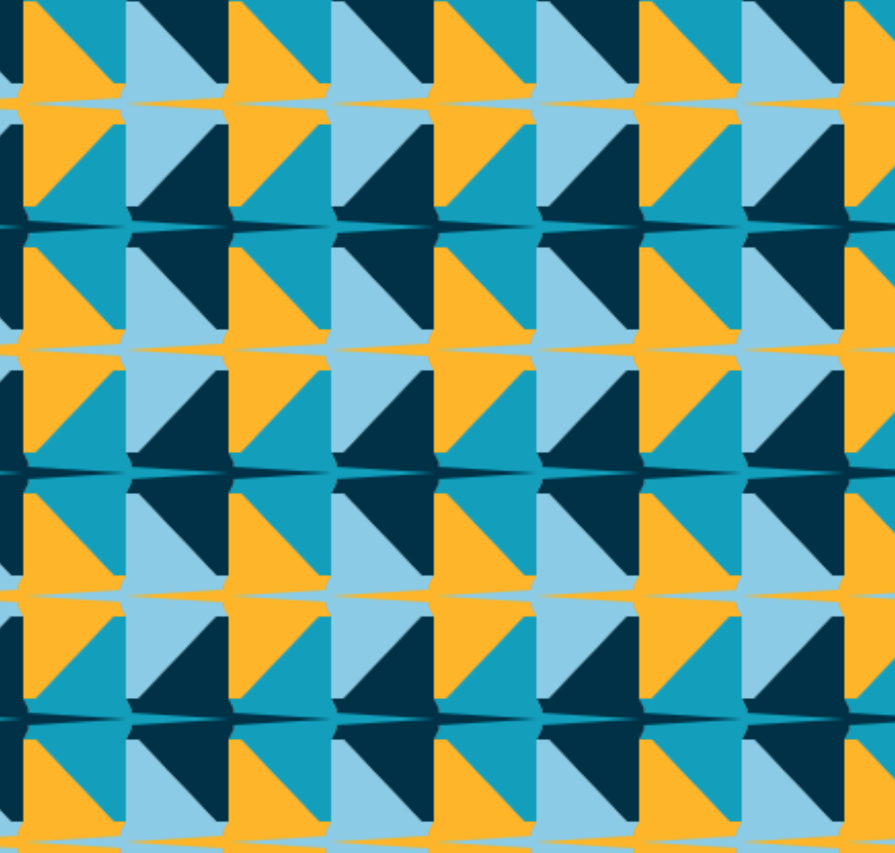
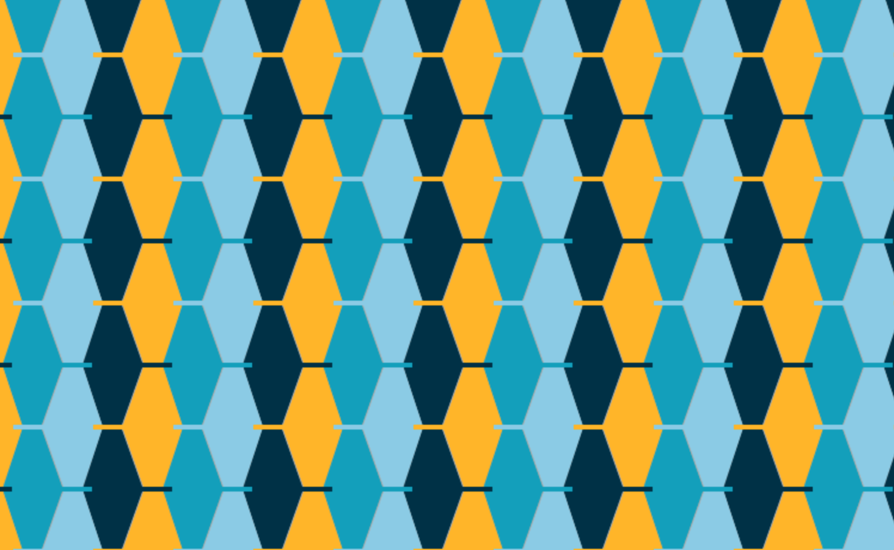
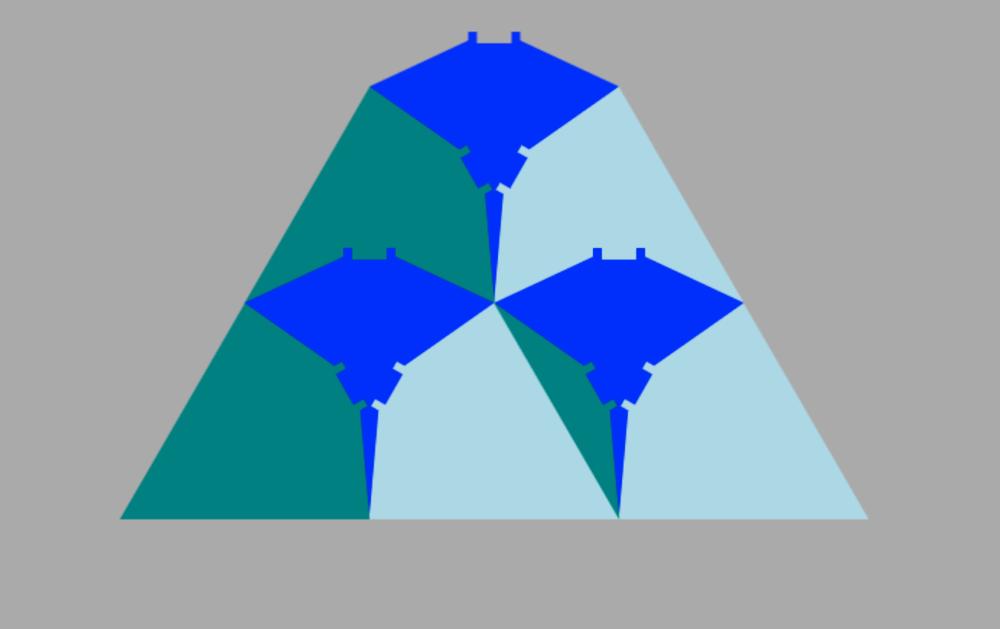
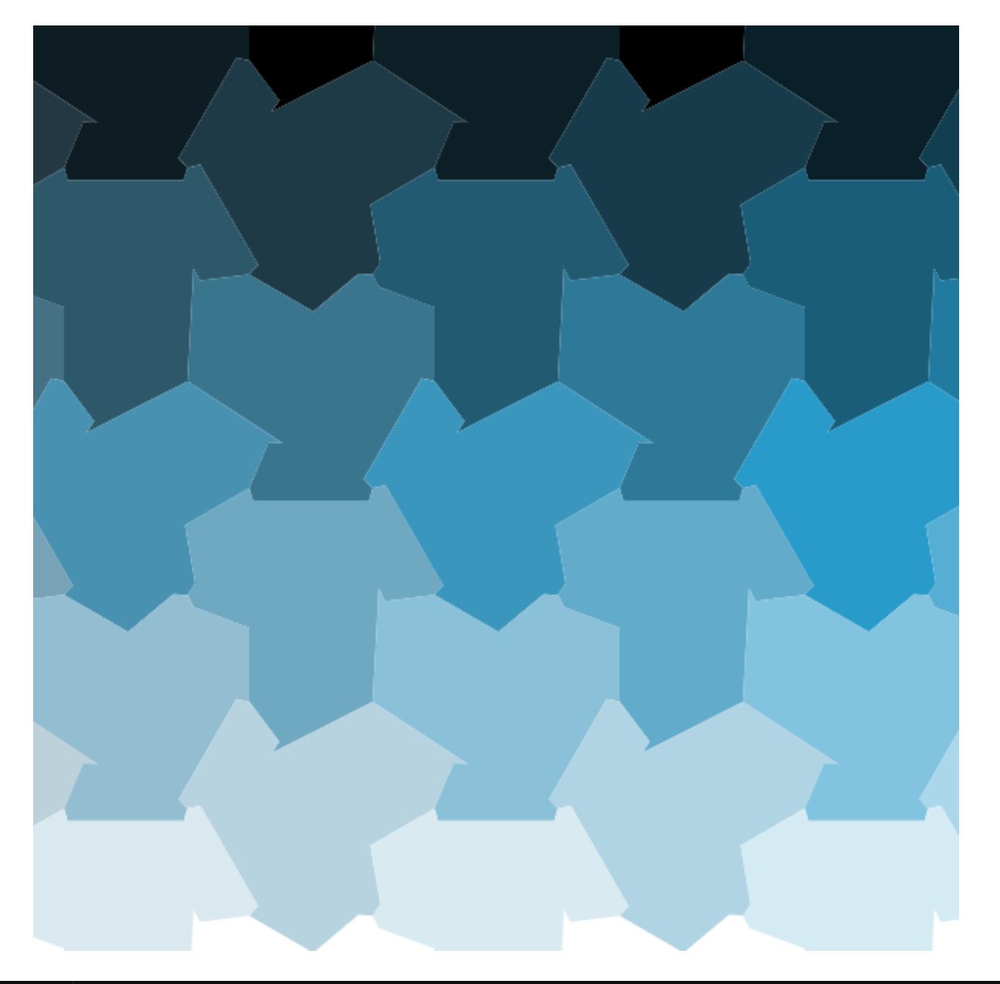

# Manta Ray Plane Tilings

I attempted to create some geometric tilings of the plane inspired by rays.

These are built with html `canvas`.

I really wanted this one to work... but alas.

Starting to get into some rotational symmetries...this one is based on our dog, who is not a manta ray.

